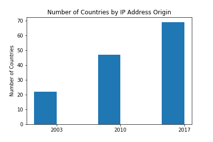
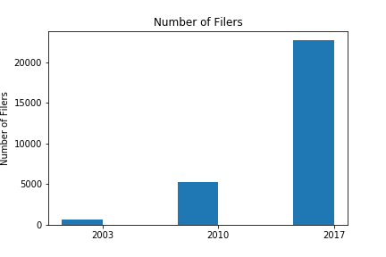
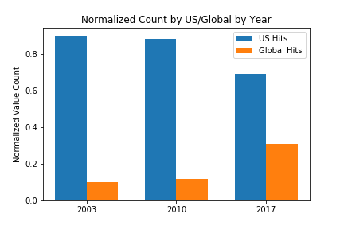
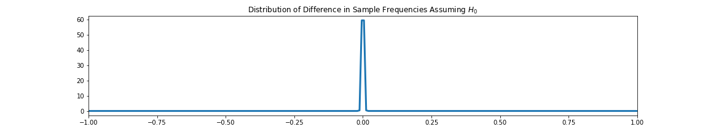

# Global Democratization of Financial Research
### *IP Address Origins from the Security Exchange Commission's EDGAR database logfile set*
## Description
This EDA looks at the log files of the Securities and Exchange Commission's EDGAR site for the period of JUNE 30 09:30:00 - 09:40:00 2003, 2010, 2017 to explore any changes in country distributions. [Source: https://www.sec.gov/dera/data/edgar-log-file-data-set.html]

## Background
EDGAR is the SEC's database that houses the periodic financial statements, registrations, and other public declarations as required by law of publicly traded companies on US exchanges.  The US market represents approximately 53% of the global financial trade, making EDGAR a highly valuable resource for investors internationally. [statista.com] 

Globally, internet usage increased from 413 million people in 2000 to over 3.4 billion people in 2016 with the US representing approximately 50% in 2000 and 8% in 2016. [ourworldindata.org, statista.com] As such, we would expect the proportion of IP addresses designated for the US to decrease. 

## The Data
#### Size
Three log files each 7 years apart selected for the period JUNE 30 09:30:00 - 09:40:00, when both the New York and London stock exchanges are simultaneously open. 

Year | Sample Size | Total Hits for the Day  
---- | -------------- | -------------------
2017 | 153,799 | 23,677,600 
2010 | 17,600 | 2,207,061 
2003 | 1,914 |  212,524 
TOTAL | 173,313 | 26,097,185

#### Features

Feature | Type | Description
------- |----- | --------------
IP Address | Categorical | The IP address consists of three numbers and three letters in the last octatet to conceal the user's identity.
CIK | Categorical | The CIK represents the filer's registration number. This can be the company itself or a third party filer.
Accession Number | Categorical | The Accession number represents a serial number for the document filed. 
Country | Categorical | Represents the country of origin for the IP Address.

#### Unique Values

  

  

  

#### NaN or Missing Data
The following columns had lack of relevant information: extention, code, size, idx, norefer, noagent, find, crawler, browser.
Additionally the 2010 Log is missing a country for 299 entries.
## Methodology & Analysis
#### Packages
Matplotlib, NumPy, SciPy.stats, Pandas, Pandasql, ipaddress

#### Geolocating IP Addresses
To identify countries by IP address, IP addresses were converted to decimal notation and searched in IP2Lite, downloadable from its site: https://lite.ip2location.com/. To run the program, a python script was executed against the files to grab the periods from the logs, convert the numbers and output a csv file in an AWS EC2 instance. Proxies & VPNs were not acknowledged.

The results were normalized. 
**IP Addresses with US Origins and Non-US Origins**

  

#### Hypothesis Testing
**Hypothesis Test for Difference in Proportions**
Conditions: The sample is random, normal, independent, and does not represent more than 10% of the population.
Null: We would expect the same proportion of US Hits in 2017 as US Hits in 2010. 
Alt: The proportions are not the same in 2017 as in 2010.

H*0*: *p2017* = *p2010*  

H*A*: *p2017* < *p2010* 

alpha = .05
The sample is random, normal, independent, and does not represent more than 10% of the population.

The Distribution of Proportions

Difference in Sample Proportions: .19

  

p-value = 0.00

Since the p-value < alpha, we can reject the Null Hypothesis. 

## Future Research
**User Habits** IP addresses are masked, but still identifiable by country.
**Browser** Looking at possible browsers used to obtain the documents can provide valuable. Determining trends in browser use could assist developers in prioritizing security features, as well as provide cyber combat units with possible attack vectors specified by country and time of day. 

## Conclusion

We can conclude that given the 2010 frequency of IP Addresses originating from the United States of America is different from the 2017 frequency. 
